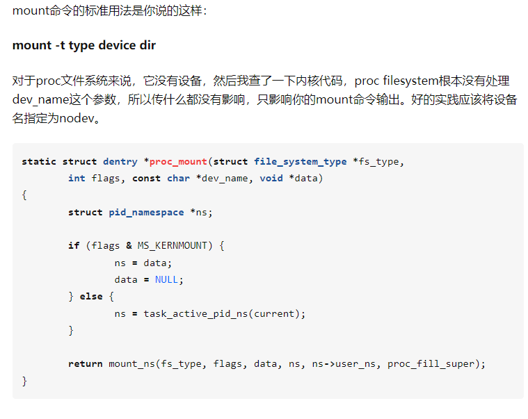

## echo $$: 当前进程的PID

```
zsh(1989739)───sudo(1992882)───hello(1992883)─┬─sh(1992887)───pstree(1993177)

# echo $$
1992887

```

## pstree -pl: show pid and don't truncate long lines

```
VM-16-2-ubuntu# pstree 1998882 -pl

hello(1998882)─┬─zsh(1998886)───pstree(1999493)
               ├─{hello}(1998883)
               ├─{hello}(1998884)
               └─{hello}(1998885)
```

## hostname

https://www.man7.org/linux/man-pages/man1/domainname.1.html

TODO: 发布一篇文章讲讲 struct utsname 的作用

```
hostname -b bird "修改为bird"
```

## readlink

```
VM-16-2-ubuntu# readlink /proc/self/exe

/usr/bin/readlink

option: -f 递归
```

## 查看进程的环境变量
```
cat /proc/2063920/environ | tr '\000' '\n'

LANG=en_US.utf8
USER=ubuntu
LOGNAME=ubuntu
HOME=/home/ubuntu
PATH=/usr/local/sbin:/usr/local/bin:/usr/sbin:/usr/bin:/sbin:/bin:/usr/games:/usr/local/games:/snap/bin
SHELL=/bin/zsh
TERM=xterm-256color
XDG_SESSION_ID=52182
XDG_RUNTIME_DIR=/run/user/1000
DBUS_SESSION_BUS_ADDRESS=unix:path=/run/user/1000/bus
XDG_SESSION_TYPE=tty
XDG_SESSION_CLASS=user
MOTD_SHOWN=pam
LANGUAGE=en_US.utf8:
SSH_CLIENT=119.39.248.97 31957 22
SSH_CONNECTION=119.39.248.97 31957 10.0.16.2 22
SSH_TTY=/dev/pts/2

```


## findmnt
```

$ findmnt --real

TARGET               SOURCE                   FSTYPE      OPTIONS
/                    /dev/sda2                ext4        rw,relatime
├─/home              /dev/sdb1                ext4        rw,relatime
├─/mnt/usb           /dev/sdc1                vfat        rw,relatime,fmask=0022,dmask=0022,codepage=437,errors=remount-ro
└─/boot/efi          /dev/sda1                vfat        rw,relatime,fmask=0022,dmask=0022,codepage=437,errors=remount-ro

```
As we can see, there are four devices mounted on the system, including our USB stick. Each device has a target directory from where we can access the device’s filesystem. Finally, we can unmount the USB stick:
```
$ umount /dev/sdc1
```


## mount bind

我们可以通过mount --bind命令来将两个目录连接起来，mount --bind命令是将前一个目录挂载到后一个目录上，所有对后一个目录的访问其实都是对前一个目录的访问，如下所示：

we can also mount a directory on another directory

We can think of the bind mount as an alias

When we use the –bind parameter, mount points inside the source directory aren’t remounted. So, if we want to bind mount a directory and all submounts inside that directory, we have to use the –rbind parameter instead.

After doing a bind mount, we won’t have access to the original content in the target directory.

### 使用场景：https://www.baeldung.com/linux/bind-mounts

#### a. 访问挂载点原先的文件

```
$ echo baeldung > /mnt/usb/hidden_file_example
$ ls /mnt/usb
hidden_file_example
$ mount /dev/sdc1 /mnt/usb
$ ls /mnt/usb
appendix.pdf pictures/
```

可以看到，原先的hidden_file_example看不见了。
如果你想访问这个文件怎么办？
最简单的方法是 umount /mnt/usb

还可以这样做：
```
$ mkdir /tmp/oldmnt
$ mount --bind /mnt /tmp/oldmnt
```
```
$ ls /tmp/oldmnt/usb
hidden_file_example
$ cat /tmp/oldmnt/usb/hidden_file_example 
baeldung
```

原因是： when we use the –bind parameter, mount doesn’t bind the submounts from the source directory. 

#### b. 在chroot环境下，访问root外的文件

```
$ mkdir /home/chroot
$ mkdir /home/chroot/bin
$ mkdir /home/chroot/lib64

$ mount --bind /bin /home/chroot/bin
$ mount --bind /lib64 /home/chroot/lib64

chroot /home/chroot

$ ls -l / 
total 16
drwxr-xr-x 2 0 0  4096 Oct 29 21:47 bin
drwxr-xr-x 8 0 0 12288 Oct 29 17:02 lib64
$ ls -l /bin/bash
-rwxr-xr-x 1 0 0 1218032 May  5 16:37 /bin/bash
$ ls -l /lib64/libc-*.so   
-rwxr-xr-x 1 0 0 2173576 Aug 17 20:03 /lib64/libc-2.33.so
```

####  c. 我们需要修改只读文件系统上的文件来测试新功能，例如固件上的只读文件系统。但是很小的修改没有必要去完全的刷新固件。

https://www.cnblogs.com/xingmuxin/p/8446115.html

假设我们要改的文件是/etc/hosts，可按下面的步骤操作： 
1. 把新的hosts文件放在/tmp下。当然也可放在硬盘或U盘上。 
mount --bind /tmp/hosts /etc/hosts       
1. 此时的/etc目录是可写的，所做修改不会应用到原来的/etc目录，可以放心测试。
3. 测试完成了执行 umount /etc/hosts 断开绑定。 

### 原理

mount --bind test1 test2为例，当mount --bind命令执行后，Linux将会把被挂载目录的目录项（也就是该目录文件的block，记录了下级目录的信息）屏蔽，即test2的下级路径被隐藏起来了（注意，只是隐藏不是删除，数据都没有改变，只是访问不到了）。同时，内核将挂载目录（test1）的目录项记录在内存里的一个s_root对象里，在mount命令执行时，VFS会创建一个vfsmount对象，这个对象里包含了整个文件系统所有的mount信息，其中也会包括本次mount中的信息，这个对象是一个HASH值对应表（HASH值通过对路径字符串的计算得来），表里就有 /test1 到 /test2 两个目录的HASH值对应关系。

命令执行完后，当访问 /test2下的文件时，系统会告知 /test2 的目录项被屏蔽掉了，自动转到内存里找VFS，通过vfsmount了解到 /test2 和 /test1 的对应关系，从而读取到 /test1 的inode，这样在 /test2 下读到的全是 /test1 目录下的文件。

## 挂载虚拟文件系统

proc、tmpfs、sysfs、devpts等都是Linux内核映射到用户空间的虚拟文件系统，他们不和具体的物理设备关联，但他们具有普通文件系统的特征，应用层程序可以像访问普通文件系统一样来访问他们。

这里只是示例一下怎么挂载他们，不会对他们具体的功能做详细介绍。

```
#将内核的proc文件系统挂载到/mnt，
#这样就可以在/mnt目录下看到系统当前运行的所有进程的信息，
#由于proc是内核虚拟的一个文件系统，并没有对应的设备，
#所以这里-t参数必须要指定，不然mount就不知道要挂载啥了。
#由于没有对应的源设备，这里none可以是任意字符串，
#取个有意义的名字就可以了，因为用mount命令查看挂载点信息时第一列显示的就是这个字符串。
dev@ubuntu:~$ sudo mount -t proc none /mnt

#在内存中创建一个64M的tmpfs文件系统，并挂载到/mnt下，
#这样所有写到/mnt目录下的文件都存储在内存中，速度非常快，
#不过要注意，由于数据存储在内存中，所以断电后数据会丢失掉
dev@ubuntu:~$ sudo mount -t tmpfs -o size=64m tmpfs /mnt
```
